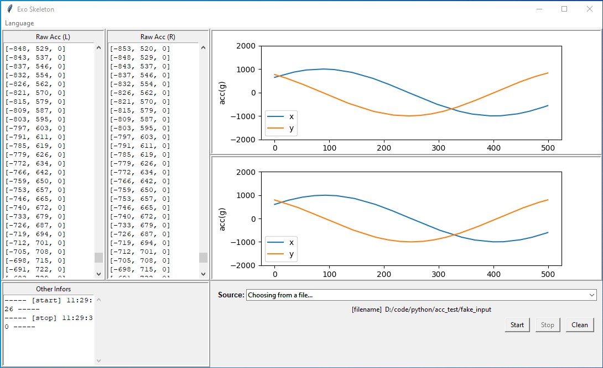

# Powered Exoskeleton Monitor

A GUI to receive and visualize real-time data from a powered exoskeleton device.



## Features
- Cross platforms
- Localization
- Modularity for customization and extension
## Installation

### Install the project
#### Prerequisites
- [git](https://git-scm.com/)
- [python 3.9](https://www.python.org/)
  
#### Windows
1. Open a Command Prompt and navigate to a directory where you want to store the project.
2. Type the following commands.
	```
	git clone https://github.com/SEN-HUI/acc_monitor.git &&
	cd acc_monitor &&
	py -m venv acc_monitor_env &&
	.\acc_monitor_env\Scripts\activate.bat &&
	py -m pip install -r requirements.txt
	```

#### Linux
1. Open a Terminal Emulator and navigate to a directory where you want to store the project.
2. Type the following commands.
	```
	git clone https://github.com/SEN-HUI/acc_monitor.git &&
	cd acc_monitor &&
	python -m venv acc_monitor_env &&
	source ./acc_monitor_env/bin/activate &&
	python -m pip install -r requirements.txt
	```
### Install the app
#### Windows
[Installer](https://drive.google.com/file/d/1UGpfyupFdDjBnmAANhcxXlJkWwXIOaff/view?usp=sharing)


## Usage
### Run source code
#### Windows
Type the following commands under the project root directory in a Command Prompt.
```
.\acc_monitor_env\Scripts\activate.bat &&
py src\acc_monitor\index.py
```
#### Linux
Type the following commands under the project root directory in a Terminal Emulator.
```
source ./acc_monitor_env/bin/activate &&
python ./src/acc_monitor/index.py
```
### Run binary file
#### Windows
Run `index.exe` under the extracted archive root directory.


## Contributing
Pull requests are welcome. For major changes, please open an issue first to discuss what you would like to change.

Please make sure to update tests as appropriate.

## License
[MIT](https://choosealicense.com/licenses/mit/)

## Authors
[Suxin Li](https://github.com/SuxinL)
